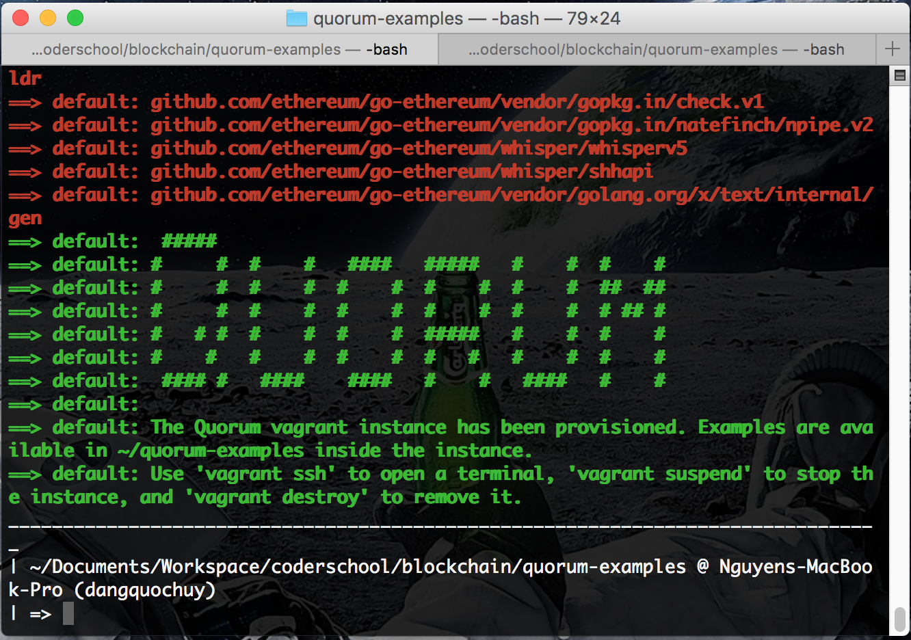
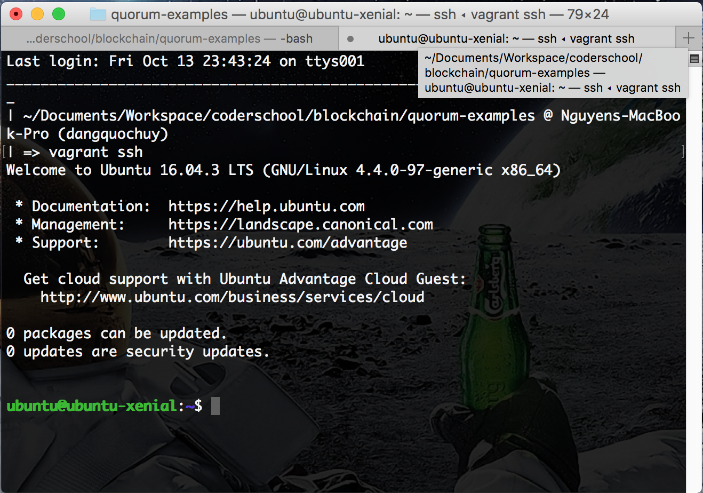
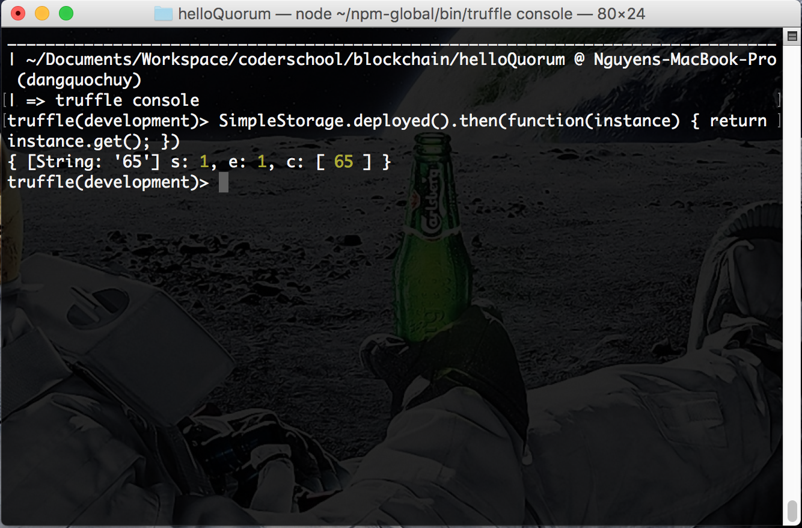
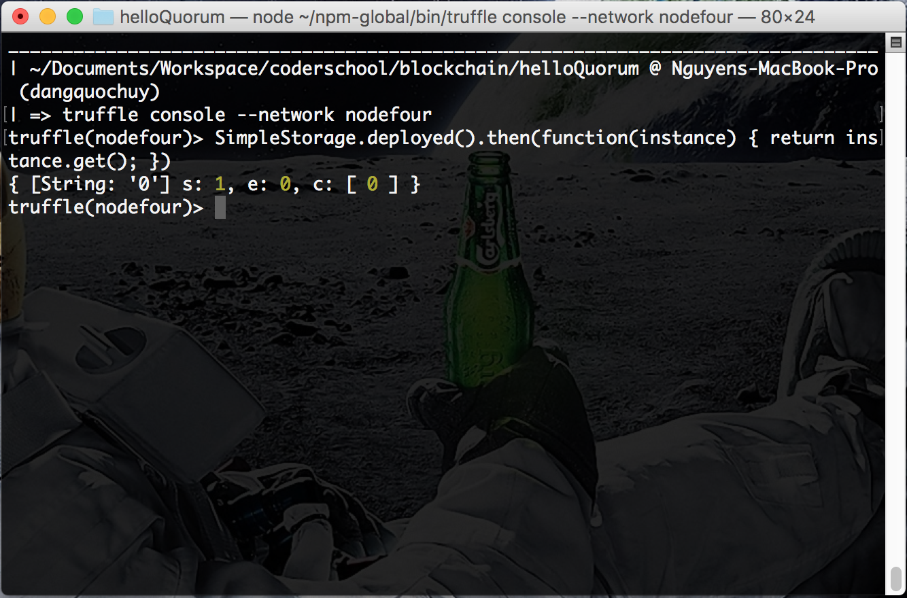
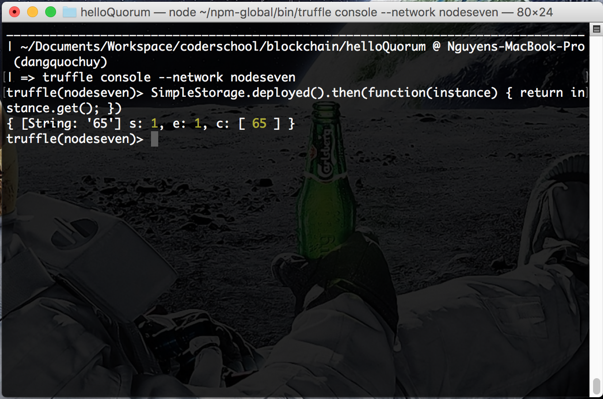

# PRIVATE ENTERPRISE BLOCKCHAINS
BUILDING DAPPS FOR QUORUM

Use case:

* Bob, Tom and Alice all create a blockchain together.
* Alice wants to send 20 TruffleCoin to Bob.
*  She doesn't want Tom (or anyone else other than Bob) to know, because she cares about her privacy.
*  Using Quorum, Alice could easily send a transaction where the transaction data is only available to her and Bob.

In this mini-project, you will:

* Set up a Quorum client
* Configure Truffle, and point it at Quorum
* Use Truffle to deploy smart contracts on Quorum
* Use Quorum's privacy features to make transactions private

-----

## Architecture

-----

## Screenshots

### Setting up your Quorum client

### Interacting With Contracts Privately

Node 1

Node 4

Node 7

-----

Source: [BUILDING DAPPS FOR QUORUM: PRIVATE ENTERPRISE BLOCKCHAINS](http://truffleframework.com/tutorials/building-dapps-for-quorum-private-enterprise-blockchains#building-dapps-for-quorum-private-enterprise-blockchains)
